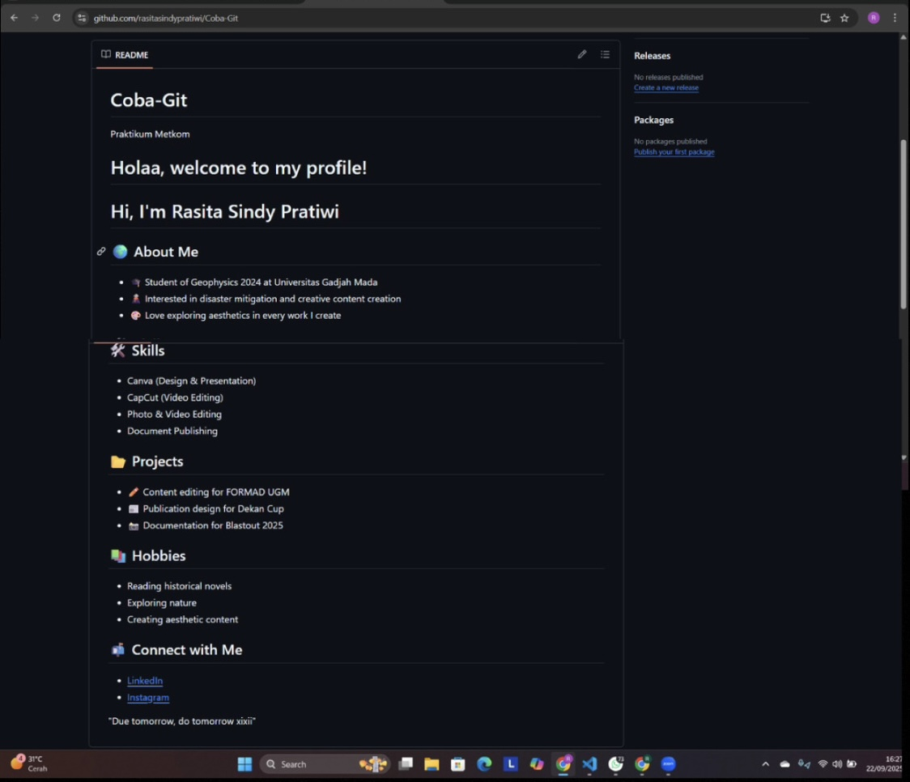
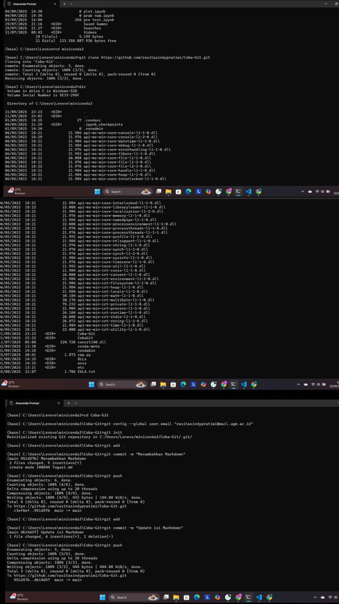
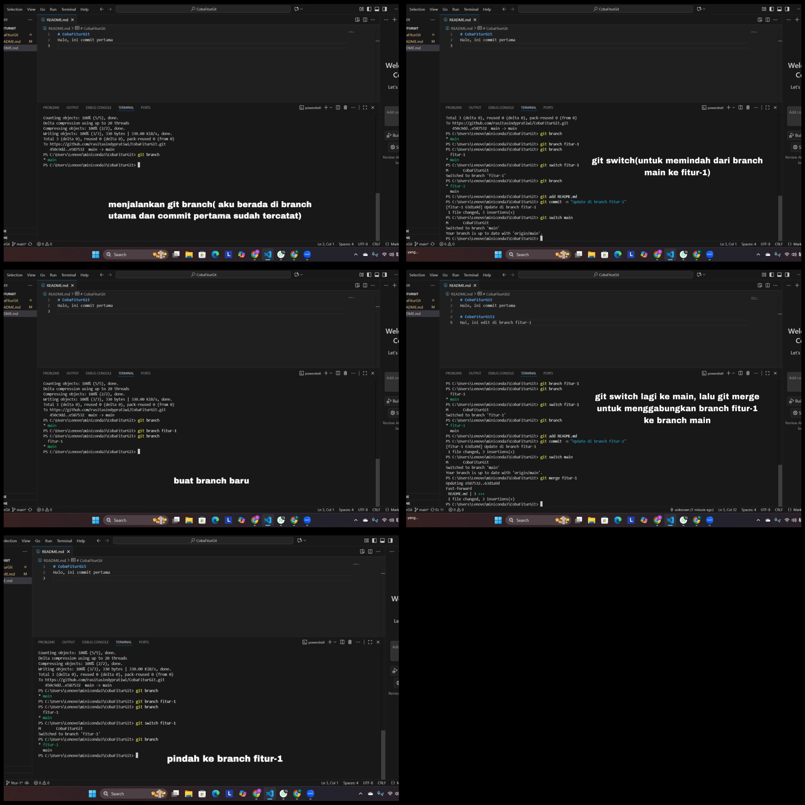

Rasita Sindy Pratiwi
24/533797/PA/22615

# 📝 Laporan Tugas 1 - Praktikum Metkom
Acara 3: Pengenalan GitHub

---
## Langkah-langkah membuat file markdown di new repository
## 1. Membuat Repository di GitHub
- Buka GitHub, klik tanda **plus (+)** di kanan atas → pilih **New Repository**.  
- Isi nama repository: **Coba-Git**.  
- Tambahkan deskripsi: *Praktikum Metkom*.  
- Klik tombol **Create Repository**.  
- Repository berhasil dibuat di GitHub.  

## 2. Clone Repository ke Lokal & Setup Git
- Setelah repository berhasil dibuat, dibuka **Anaconda Prompt**.  
- Cek lokasi folder dengan perintah `dir`, lalu pindah ke folder `miniconda3` menggunakan `cd miniconda3`.  
- Lakukan *clone* repository dengan perintah `git clone` menggunakan URL repository GitHub.  
- Setelah proses clone selesai, masuk ke folder `Coba-Git` dengan perintah `cd Coba-Git`.  
- Lakukan konfigurasi Git dengan mengatur email dan username (hanya perlu sekali di awal).  
- Terakhir, jalankan perintah `git init` untuk memastikan folder sudah dikenali sebagai repository Git.  

## 3. Membuat & Mengedit File Markdown
- Buka **VSCode**, lalu pilih **Open Folder** → arahkan ke folder `Coba-Git`.  
- Edit file `README.md`, isi dengan profil singkat (Nama, NIM, dsb).  
- Tambahkan file baru bernama `tugas1.md` untuk laporan ini.  
- Simpan semua perubahan.  

## 4. Push Perubahan ke GitHub
- Kembali ke **Anaconda Prompt**, lalu jalankan `git add .` untuk menambahkan semua perubahan.  
- Gunakan `git commit -m "Menambahkan README dan tugas1.md"` untuk menyimpan perubahan.  
- Jalankan `git push` untuk mengirim perubahan ke GitHub.  
- Setelah itu buka GitHub dan lakukan refresh.  
- File `README.md` dan `tugas1.md` sudah muncul di repository.  

---
## Hal yang dibingungkan
~ Kadang muncul error/fatal setelah masuk folder Coba-Git di Anaconda Prompt.
~ Sering lupa urutan langkah Git: harus git add dulu sebelum git commit, atau git commit sebelum git push.
~ Bingung saat Git menandai folder CobaFiturGit sebagai modified content tanpa menampilkan file spesifik.
~ Kadang tidak tahu file baru apakah sudah di-track atau masih untracked.
~ Sulit membedakan antara commit lokal dengan commit yang sudah di-push ke GitHub.
~ Kadang tidak tahu cara melihat riwayat perubahan atau commit sebelumnya.
~ Bingung ketika Git meminta menyelesaikan konflik merge, tidak tahu langkah apa yang harus dilakukan.
~ Kadang khawatir melakukan push bisa menimpa perubahan di GitHub yang sudah ada.

## Fitur-fitur yang telah dipelajari
Dari penugasan praktikum kali ini, saya mendapat pengetahuan mengenai fitur-fitur yang ada didalam github, diantaranya ada :

1. git clone <URL>
→ menyalin repository dari GitHub ke komputer lokal.

2. git config --global user.email "emailmu"
→ untuk menyimpan alamat email GitHub agar dikenali setiap kali commit.

3. git init
→ membuat repository Git baru secara lokal (meski kalau sudah clone biasanya tidak perlu lagi).

4. git add .
→ menambahkan semua perubahan file di folder tersebut ke staging area.

5. git commit -m "pesan"
→ menyimpan perubahan ke repository lokal dengan pesan tertentu.

6. git push
→ mengirim perubahan dari repository lokal ke repository GitHub (remote).

7. git branch 
→ digunakan untuk melihat daftar branch atau membuat branch baru, yaitu jalur terpisah agar bisa mengerjakan fitur tanpa mengganggu branch utama. 

8. git switch 
→ digunakan untuk berpindah dari satu branch ke branch lain, dan juga bisa membuat branch baru sekaligus langsung berpindah ke branch itu.

9. git merge 
→ digunakan untuk menggabungkan perubahan dari branch lain ke branch yang sedang aktif. Jika ada perubahan yang bertabrakan, Git akan meminta untuk menyelesaikan konflik terlebih dahulu.

## Penugasan dan Bukti 
## 1. Membuat profil README
Pada profil ini berisi identitasku secara garis besar, mulai dari siapa aku, minat dan ketertarikan, kemampuan atau skill yang dimiliki, beberapa proyek yang pernah aku kerjakan, hobi yang aku sukai, serta cara untuk terhubung denganku melalui LinkedIn dan Instagram.

## 2. Bukti membuat new repository dan mencoba fitur github lainnya
Pada penugasan ini saya membuat 2 repository baru, yang pertama yaitu Coba-Git, yang saya gunakan untuk menyimpan file README.md berisi profilku dan file Tugas1.md yang berisi penugasanku. Lalu repository kedua, CobaFiturGit, yang berisi penggunaan fitur git seperti git branch, git switch, dan git merge. 

